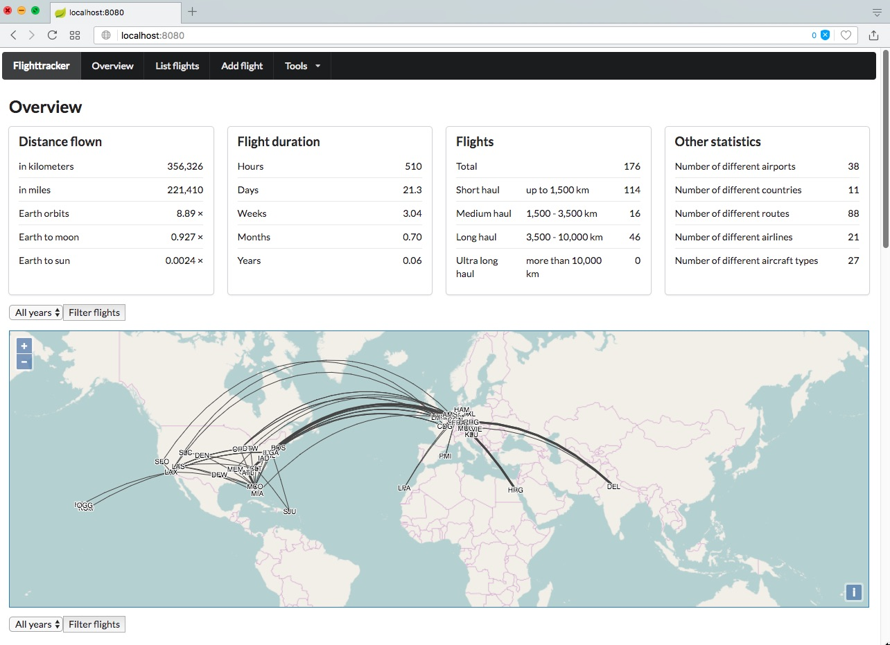

# Introduction

The flighttracker was born out of my nerdy necessity to have a bookkeeping tool of all the flights that I have undertaken so far.
For years I was quite happy with flugstatistik.de but it hasn't really evolved over the last years leaving a UI that looks quite outdated. In addition there was no way for me to backup the data stored there, which leads to a formidable vendor lock-in. What happens when they decide to stop providing their service or I simply forget my login credentials?

From what I have seen there are no real alternatives. Openflights.org is an excellent idea but the UI is even worse than flugstatistik.de looking like it has been hacked together in an hour or two. Don't get me wront I'm pretty sure a good amount of time has been invested but for me it simply looks awful.

So, as no appropriate tool was available I simply decided to write one myself. The overall UI somewhat follows a few ideas from flugstatistik.de but (hopefully) is a bit more modern and streamlined.

# Build

The flighttracker is bundled either as a simple Java web application (a WAR archive) or as a Spring Boot application.

First clone the repository and switch to the created directory:

    $ git clone https://github.com/perdian/flighttracker.git
    $ cd flighttracker

## WAR

To create the WAR file simply execute the default Maven build command:

    $ mvn clean package

Then copy the WAR file to wherever your servlet container is located:

    $ cp target/flighttracker-1.0.0-SNAPSHOT.war /where/your/container/is/webapps/flighttracker.war

That's it! Start your servlet container and the flighttracker should be up and running.

    http://localhost:8080/flighttracker/

## Spring Boot

You can also launch the application directly from within the WAR file as Spring Boot application:

    $ mvn clean package
    $ java -jar target/flighttracker-1.0.0-SNAPSHOT.war

When running this directly the embedded Tomcat will provide the application directly from the root:

    http://localhost:8080/

# Known limitations

There are a few known limitations which will hopefully be addressed in future versions:

## Database configuration

Currently the hardcoded H2 embedded database always stores its files in the `~/Development/databases/` folder on the machine on which the web application is running. As all the values are configured within Spring Boots `application.yml` it shouldn't be too difficult to overwrite them with some better suited and configurable values.

## Clientability

Right now there is no way to have multiple users share an instance of the flighttracker application. I've already planned to introduce a `userId` to the `flight` table and introduce Spring Security to make sure the user object is available. But as you can see nothing has been implemented yet.

## World map

Right now flights traveling eastwards from the US or westwards of Asia/Australia are not correctly rendered by the Openlayers map. The data is being available in the JSON but somehow the map doesn't render it correctly.

# Credits

This application would not be possible without the great work of other open source projects.

A big thank you therefore goes to:

* Openflights.org for its collection of airport and airline data as well as inspiration of how to display the flights on the map (https://openflights.org/data.html).
* Openlayers for the ground work in providing the world map (https://openlayers.org/).
* arc.js for handling the pain of computing a great circle between two airports (https://github.com/springmeyer/arc.js/).
* Semantic UI for its beautiful frontend components (https://semantic-ui.com/).
* JQuery for the ultimate DOM manipulation tool (https://jquery.com/).
* Spring Boot for the heavy lifting in the backend (https://projects.spring.io/spring-boot/).
* Hibernate for the best SQL abstraction layer (http://hibernate.org/).

# License

The flighttracker is licensed under the Apache Licence 2.0 (http://www.apache.org/licenses/).