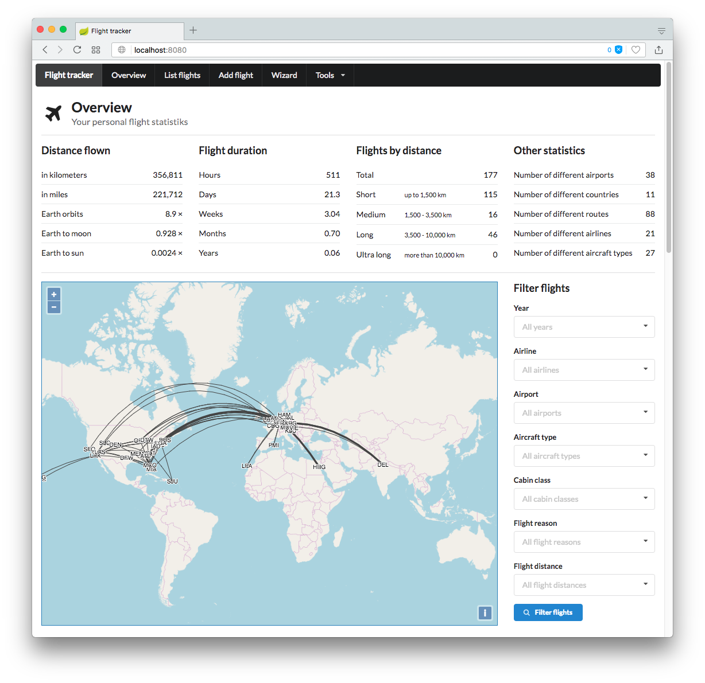

# Introduction

The flighttracker was born out of my nerdy necessity to have a bookkeeping tool of all the flights that I have undertaken so far.
For years I was quite happy with flugstatistik.de but it hasn't really evolved over the last years leaving a UI that looks quite outdated. In addition there was no way for me to backup the data stored there, which leads to a formidable vendor lock-in. What happens when they decide to stop providing their service or I simply forget my login credentials?

From what I have seen there are no real alternatives. Openflights.org is an excellent idea but the UI is even worse than flugstatistik.de looking like it has been hacked together in an hour or two. Don't get me wront I'm pretty sure a good amount of time has been invested but for me it simply looks awful.

So, as no appropriate tool was available I simply decided to write one myself. The overall UI somewhat follows a few ideas from flugstatistik.de but (hopefully) is a bit more modern and streamlined.

# Build

The flighttracker is bundled either as a simple Java web application (a WAR archive) or as a Spring Boot application.

First clone the repository and switch to the created directory:

    $ git clone <https://github.com/perdian/flighttracker.git>
    $ cd flighttracker

## WAR

To create the WAR file simply execute the default Maven build command:

    $ mvn clean package

Then copy the WAR file to wherever your servlet container is located:

    $ cp target/flighttracker.war /where/your/container/is/webapps/flighttracker.war

That's it! Start your servlet container and the flighttracker should be up and running.

    <http://localhost:8080/flighttracker/>

## Spring Boot

You can also launch the application directly from within the WAR file as Spring Boot application:

    $ mvn clean package
    $ java -jar target/flighttracker.war

When running this directly the embedded Tomcat will provide the application directly from the root:

    <http://localhost:8080/>

# Database configuration

By default flighttracker uses a hardcoded H2 embedded database which stores its files in the `~/Development/databases/` folder on the machine on which the web application is running.

If you want to change this to the database of your choice you have to provide a separate Spring Boot configuration file using one of the methods document in the Spring Boot documentation: <https://docs.spring.io/spring-boot/docs/current/reference/html/boot-features-external-config.html>.

For example if you would like to define a MySQL database running on the local machine when executing the flighttracker application directly as Spring Boot application the command line should be changed to:

    $ java -jar target/flighttracker.war -Dspring.config.location=file:/where/your/config/file/is/located/flighttracker.yml

The actual configuration file must conform to the Spring Boot JPA definition of a datasource.

An example for creating a configuration file using a MySQL database will look like this:

    spring:
      datasource:
        driver-class-name: com.mysql.jdbc.Driver
        url: jdbc:mysql://127.0.0.1/DATABASE_NAME?useUnicode=true&useJDBCCompliantTimezoneShift=true&useLegacyDatetimeCode=false&serverTimezone=UTC
        username: DATABASE_USER_USERNAME
        password: DATABASE_USER_PASSWORD
      jpa:
        hibernate:
          ddl-auto: update
        properties:
          hibernate:
            dialect: org.hibernate.dialect.MySQLDialect

The MySQL JDBC driver is already part of the flighttracker WAR distribution. For any other database you'll need to provide the JDBC drivers yourself and make sure the server has appropriate access to these drivers.

# Authentication

By default the application doesn't come with any built in application and works in an open single user mode: All flights are implicitely associated to a single user.

Currently there are two options to configure authentication: Using the internal database or using an LDAP backend.

## Internal database

Using the internal database is the easiest option and requires only one additional configuration parameter (see database configuration how to make additional configuration parameters available to the application).

    flighttracker:
      authentication:
        type: internaldatabase

Now the application will authenticate using the entries in the internal database.

For each login the application will look for an entry within the `user` table that has `internaldatabase` as value of the `type`, a `username` column value equal to the value entered in the login form and a `password` column value equal to the SHA-256 hash (hex encoded) of the password entered in the login form.

# LDAP

Using a LDAP backend requires some additional options to be set as configuration parameters:

    flighttracker:
      authentication:
        type: ldap
        ldap:
          url: ldap://127.0.0.1
          baseDn: dc=example,dc=com
          userDn: ou=users
          bindDn: cn=x,dc=example,dc=com
          bindPassword: yourbindpassword
          usernameField: uid

The login will be made against the LDAP backend configured. After that a dummy user will be inserted into the local database with the `authentication_source` column set to `ldap` and the `username` column set to the username used during the login. The `password` column will remain `null`.

# External data providers

The flight creation wizard allows fetching data from external source (like airlines) to be fetched and included into the generated flight.

As there is no free API for retrieving flight information specific solutions have to be integrated. Right now the following providers have been integrated but need to be configured explicitely.

If no special configurations have been made these providers will not be able to contribute any data but all functionality will still work correctly. Any additional data providers are purely optional.

## Lufthansa

For accessing Lufthansa you need to configure the following Spring Boot configuration parameters:

    flighttracker:
      data:
        lufthansa:
          client_id: CLIENT_ID
          client_secret: CLIENT_SECRET

The `client_id` and `client_secret` can be obtained by registering a new application on the
Lufthansa developer portal (https://developer.lufthansa.com/).

# Automatic backup

The system can automatically create a backup archive of the complete data (users including their stored flights). To enable the backup two properties need to be set in the `application.yml` configuration file:

    flighttracker:
      backup:
        cron: 0 0 5 * * 1
        target: file:/data/flighttracker/backup/

The `cron` value defines the times when the backup operations should run and the `target` values defines the directory where the backup archives are being written into.

The backup archives themselves adhere to the naming convention `flighttracker-backup-<date>.xml` where `<date>` will be replaced with the date on which the backup is being performed.

# Credits

This application would not be possible without the great work of other open source projects.

A big thank you therefore goes to:

* Openflights.org for its collection of airport and airline data as well as inspiration of how to display the flights on the map (<https://openflights.org/data.html>).
* Openlayers for the ground work in providing the world map (<https://openlayers.org/>).
* arc.js for handling the pain of computing a great circle between two airports (<https://github.com/springmeyer/arc.js/>).
* Semantic UI for its beautiful frontend components (<https://semantic-ui.com/>).
* JQuery for the ultimate DOM manipulation tool (<https://jquery.com/>).
* Spring Boot for the heavy lifting in the backend (<https://projects.spring.io/spring-boot/>).
* Hibernate for the best SQL abstraction layer (<http://hibernate.org/>).

# License

The flighttracker is licensed under the Apache Licence 2.0 (<http://www.apache.org/licenses/>).