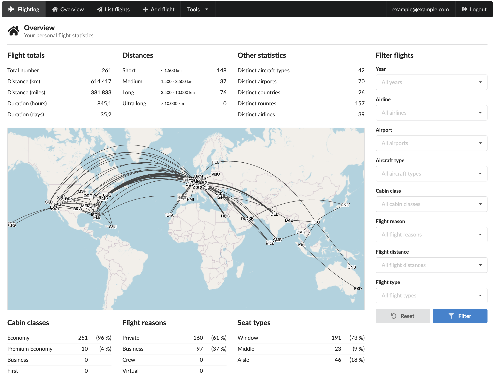

# Introduction

The flightlog was born out of my nerdy necessity to have a bookkeeping tool of all the flights that I have undertaken so far.
For years I was quite happy with flugstatistik.de but it hasn't really evolved over the last years leaving a UI that looks quite outdated and a featureset that is okayish but lacks some of the things I would like to see.
In addition there was (and still is) no way to backup the data stored there, which leads to a formidable vendor lock-in.
What happens when they decide to stop providing their service or I simply forget my login credentials?
Just not good enough.

From what I saw at the time (and from what I see today) there are no real alternatives.
Openflights.org is an excellent idea but the UI is even worse than flugstatistik.de, looking like it has been hacked together in an hour or two.
Don't get me wrong I'm pretty sure a good amount of time has been invested but for me it simply looks awful.

So, as no appropriate tool was available I simply decided to write one myself.
The overall UI somewhat follows a few ideas from flugstatistik.de but (hopefully) is a bit more modern and streamlined.

# Build

The flightlog is bundled either as a Spring Boot application.

First clone the repository and switch to the created directory:

    $ git clone https://github.com/perdian/flightlog.git
    $ cd flightlog

## WAR

To create the WAR file execute the default Maven `package` command:

    $ mvn clean package
    $ java -jar target/flightlog.war

When running this directly the embedded Tomcat will provide the application directly from the root:

    http://localhost:8080/

## Docker container

### Fetch from GitHub package registry

An alternative do running the WAR file directly is to create a Docker container that wraps the complete application.

Releases are automatically pushed to DockerHub packages so all you need to do is to run the Docker image.

    $ docker run -p 8080:8080 perdian/flightlog:1.0.0

Replace the `1.0.0` version with the latest release which can be found at https://github.com/perdian/flightlog/releases.

The application will be available on the machine on which you're executing the container at:

    http://localhost:8080/

### Build from sources

If you want to build the Docker image yourself from the flightlog sources it can be done like this:

    $ mvn clean package
    $ docker build -t perdian/flightlog .

After the container is built you can verify the application by running it:

    $ docker run -p 8080:8080 perdian/flightlog

The application will be available on the machine on which you're executing the container at:

    http://localhost:8080/

To persist the database in which the flightlog stores all its information you have to mount the directory `/var/flightlog/database/` from the container to somewhere on your host machine:

    $ docker run -v /path/to/your/host/directory:/var/flightlog/database -p 8080:8080 perdian/flightlog

# Database configuration

By default flightlog uses a hardcoded H2 embedded database which stores its files in the `/var/flightlog/database/` folder on the machine on which the web application is running.

If you want to change this to the database of your choice you have to provide a separate Spring Boot configuration file using one of the methods document in the Spring Boot documentation: <https://docs.spring.io/spring-boot/docs/current/reference/html/boot-features-external-config.html>.

For example if you would like to define a MySQL database running on the local machine when executing the flightlog application directly as Spring Boot application the command line should be changed to:

    $ java -Dspring.config.location=file:/where/your/config/file/is/located/flightlog.yml -jar target/flightlog.war

The actual configuration file must conform to the Spring Boot JPA definition of a datasource.

An example for creating a configuration file using a MySQL database will look like this:

    spring:
      datasource:
        driver-class-name: com.mysql.jdbc.Driver
        url: jdbc:mysql://127.0.0.1/DATABASE_NAME?useUnicode=true&useJDBCCompliantTimezoneShift=true&useLegacyDatetimeCode=false&serverTimezone=UTC
        username: DATABASE_USER_USERNAME
        password: DATABASE_USER_PASSWORD
      jpa:
        hibernate:
          ddl-auto: update
        properties:
          hibernate:
            dialect: org.hibernate.dialect.MySQLDialect

The MySQL JDBC driver is already part of the flightlog WAR distribution. For any other database you'll need to provide the JDBC drivers yourself and make sure the server has appropriate access to these drivers.

# Authentication

The application ships with a few options of authentication providers available.

By default no authentication is activated, which means without any additional configuration the application works in a single user mode: All flights are implicitely associated to a single user.

If you want to enable authentication for the system you'll have to set the following configuration property:

    flightlog:
      authentication:
        required: true

## Local database authentication

Using the internal database is the easiest option and is automatically active if the `flightlog.authentication.required` property has been set to `true`.

For each login the application will look for an entry within the `user` table that has `internaldatabase` as value of the `authentication_source`, a `username` column value equal to the value entered in the login form and a `password` column value equal to the SHA-256 hash (hex encoded) of the password entered in the login form.

If you want to disable the local authentication (because you want to only use other authentication methods) then you'll need to disable it with the following configuration property:

    flightlog:
      authentication:
        local:
          enabled: false

# LDAP authentication

Using a LDAP backend requires some additional options to be set as configuration parameters:

    flightlog:
      authentication:
        ldap:
          enabled: true
          url: ldap://127.0.0.1
          base-dn: dc=example,dc=com
          user-dn: ou=users
          bind-dn: cn=x,dc=example,dc=com
          bind-password: yourbindpassword
          username-field: uid

The login will be made against the LDAP backend configured. After that a dummy user will be inserted into the local database with the `authentication_source` column set to `ldap` and the `username` column set to the username used during the login. The `password` column will remain `null`.

If both the local database authentication and the LDAP authentication have been activated the application will first check if a local user is found, and if that's the case will use the local user. Only if no local user is found will the application look for a user in the specified LDAP system.

## OAuth2 authentication

The application supports OAuth2 authentication via the following providers:

* Google

To enable the OAuth authentication you have to set the following configuration parameters:

    flightlog:
      authentication:
        oauth:
          enabled: true

For each login the application will perform an OAuth2 authentication. After the successful authentication an entry within the `user` table that has `internaldatabase` will be made, populated with the values retrieved from the OAuth2 provider.

Note that in the default setup if the user authenticated via OAuth2 is *not* existing in the local database yet, then the authentication will fail. This is a concious choice to prohibit someone spamming the system and creating entries in the database by simply performing multiple OAuth2 authentications.

The are two ways to allow an authentication from a new OAuth2 account:

### Disabling registration blocker

By setting the configuration parameter `flightlog.registration.restricted` to `false` will bypass the check for existence and will create a new entry in the local database for every new account authenticated via OAuth2:

    flightlog:
      registration:
        restricted: false

### Adding the email address to the whitelist

When a new OAuth2 account is found the system will check the internal *whitelist* whether the email address of the new user is found in the whitelist. If that's the case then the new user will be added into the database and the authentication will succeed.

There are two places where the whitelisted email address are stored:

One option is to use the database table `registrationwhitelist` which simply contains an `email` column for the email to be whitelisted. To add members to the whitelist you can perform the following simple SQL statement against the local database:

    INSERT INTO registrationwhitelist (email) VALUES ('theaddress@example.com');

A second option (which is mainly designed for a personal installation without any open registration) is to add the whitelisted email addresses directly into the Spring configuration:

    flightlog:
      registration:
        restricted: true
        email-whitelist:
          - "example@example.com"

### Detailed configuration: Google

To activate authentication via Google you'll have to register your Google client id and client secret with Spring security as additional configuration parameters (see database configuration how to make additional configuration parameters available to the application):

    spring
      security:
        oauth2:
          client:
            registration:
              google:
                client-id: YOUR_CLIENT_ID
                client-secret: YOUR_CLIENT_SECRET

For detailed information of how to create the credentials see https://developers.google.com/identity/protocols/OAuth2.

When clients have been registered they will automatically be made available.

# External data providers

The flight creation wizard allows fetching data from external source (like airlines) to be fetched and included into the generated flight.

As there is no free API for retrieving flight information specific solutions have to be integrated. Right now the following providers have been integrated but need to be configured explicitely.

If no special configurations have been made these providers will not be able to contribute any data but all functionality will still work correctly. Any additional data providers are purely optional.

## Lufthansa

For accessing Lufthansa you need to configure the following Spring Boot configuration parameters:

    flightlog:
      data:
        lufthansa:
          client-id: CLIENT_ID
          client-secret: CLIENT_SECRET

The `client-id` and `client-secret` can be obtained by registering a new application on the
Lufthansa developer portal (https://developer.lufthansa.com/).

# Automatic backup

The system can automatically create a backup archive of the complete data (users including their stored flights). To enable the backup two properties need to be set in the `application.yml` configuration file:

    flightlog:
      backup:
        cron: 0 0 5 * * 1
        target: file:/var/flightlog/backup/

The `cron` value defines the times when the backup operations should run and the `target` values defines the directory where the backup archives are being written into.

The backup archives themselves adhere to the naming convention `flightlog-backup-<date>.xml` where `<date>` will be replaced with the date on which the backup is being performed.

# Credits

This application would not be possible without the great work of other open source projects.

A big thank you therefore goes to:

* Openflights.org for its collection of airport and airline data as well as inspiration of how to display the flights on the map (<https://openflights.org/data.html>).
* Openlayers for the ground work in providing the world map (<https://openlayers.org/>).
* arc.js for handling the pain of computing a great circle between two airports (<https://github.com/springmeyer/arc.js/>).
* Semantic UI for its beautiful frontend components (<https://semantic-ui.com/>).
* JQuery for the ultimate DOM manipulation tool (<https://jquery.com/>).
* Spring Boot for the heavy lifting in the backend (<https://projects.spring.io/spring-boot/>).
* Hibernate for the best SQL abstraction layer (<http://hibernate.org/>).

# License

The flightlog is licensed under the Apache Licence 2.0 (<http://www.apache.org/licenses/>).
